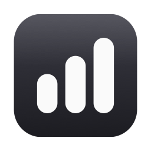
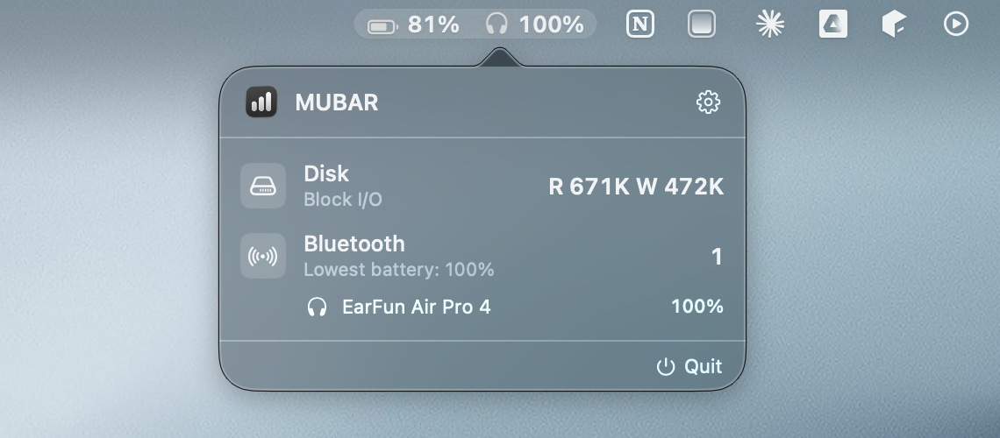
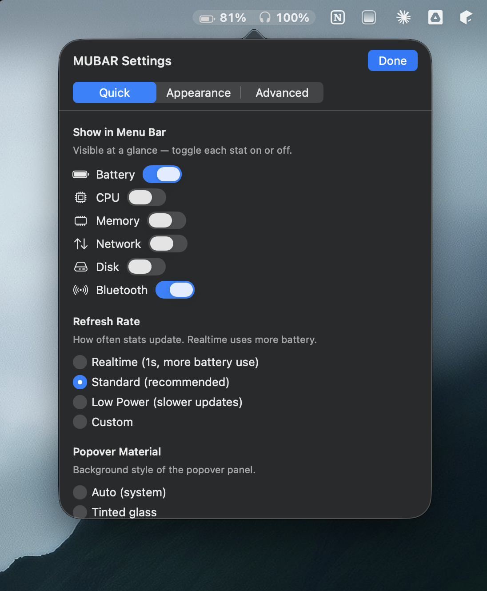

<div align="center">



# MUBAR

**Live system stats, right in your macOS menu bar.**

Battery · CPU · Memory · Network · Disk · Bluetooth — at a glance, no clicking required.

</div>

---

## Overview

MUBAR is a lightweight native macOS menu bar app. It shows the system stats you
care about directly in the menu bar, and a clean popover with the full details.
It reads Bluetooth device batteries — including AirPods and **generic earbuds
that no other tool supports** — by talking to the standard BLE Battery Service.

<div align="center">

</div>

## Features

- **At-a-glance menu bar** — every enabled stat renders inline next to the clock. No click needed.
- **Six stats** — Battery, CPU, Memory, Network throughput, Disk I/O, Bluetooth.
- **Bluetooth battery for real** — AirPods/Beats via Apple's Continuity BLE advertisements, and *any* device that publishes the standard GATT Battery Service (`0x180F`) — most modern earbuds, controllers, and BLE peripherals.
- **Priority device** — pin one Bluetooth device so the menu bar always shows its battery and icon.
- **Per-stat refresh rates** — Realtime / Standard / Low Power presets, or custom 1–120s intervals per stat.
- **Deeply customizable** — display mode, separators, colors, weight, spacing, accent themes, popover material (tinted / frosted / solid), density, an optional background pill, and toggleable animations.
- **Light footprint** — ~27 MB physical memory; BLE radios released when not in use.
- **Hover to open**, tap-away to close, launch at login, native About panel.

<div align="center">

</div>

## Requirements

- macOS 13 Ventura or later
- Apple Silicon or Intel Mac
- To build: Xcode 15+ and [XcodeGen](https://github.com/yonyz/XcodeGen)

## Install

Download `MUBAR.dmg` from [Releases](../../releases), open it, and drag **MUBAR**
onto the **Applications** folder.

> MUBAR is ad-hoc signed (not notarized). On first launch macOS may say it's
> from an unidentified developer — right-click the app → **Open** → **Open**, or
> allow it under **System Settings → Privacy & Security**.

On first launch grant the **Bluetooth** permission prompt if you want device
battery readings. Everything else works without it.

## Building from source

MUBAR uses [XcodeGen](https://github.com/yonyz/XcodeGen) — the `.xcodeproj` is
generated from `project.yml` and is not committed.

```bash
# 1. Install XcodeGen
brew install xcodegen

# 2. Generate the Xcode project
xcodegen generate

# 3a. Build & run from Xcode
open MUBAR.xcodeproj      # then press ⌘R

# 3b. …or build a Release app from the command line
xcodebuild -project MUBAR.xcodeproj -scheme MUBAR -configuration Release \
  -destination 'platform=macOS,arch=arm64' build
```

### Building the installer DMG

A one-shot script builds the Release app, ad-hoc signs it, and packages a
drag-to-install DMG with a custom background:

```bash
bash tools/build_dmg.sh        # → MUBAR.dmg
```

It depends only on `hdiutil` and `osascript` (no third-party tools). The DMG
background and app icon are generated from code:

```bash
swift tools/make_icon.swift            # regenerate the app icon set
swift tools/make_dmg_background.swift  # regenerate the DMG background
```

## How Bluetooth battery works

macOS keeps device battery levels inside `bluetoothd` and exposes them to
first-party apps (Control Center) through entitlement-gated private APIs that
third-party apps cannot use. MUBAR gets the data anyway, from public sources:

| Device class | How MUBAR reads it |
|---|---|
| AirPods, Beats (H1/H2/W1) | Apple Continuity BLE advertisements (`CBCentralManager` scan, manufacturer `0x004C`, proximity-pairing payload) |
| Earbuds / peripherals with BLE | Standard GATT **Battery Service** `0x180F`, characteristic `0x2A19` |
| Classic-BT devices | `system_profiler SPBluetoothDataType` + the `com.apple.Bluetooth` device cache + `IORegistry` |

This is why MUBAR can show battery for devices that AirBattery, MagicPods, and
similar tools don't — it isn't limited to Apple devices.

## Architecture

```
MUBARApp                      SwiftUI App entry; installs the AppDelegate
AppDelegate                   NSStatusItem + NSPopover, hover handling, animations
SamplerCoordinator            1 Hz timer, per-stat interval gating, BLE lifecycle

Services/
  BatteryService              IOKit IOPSCopyPowerSourcesInfo
  CPUService                  host_processor_info deltas
  MemoryService               host_statistics64 (vm_statistics64)
  NetworkService              getifaddrs byte-rate deltas
  DiskService                 IOKit IOBlockStorageDriver counters
  BluetoothService            merges all Bluetooth sources into one snapshot
  AirPodsScanner              CoreBluetooth Continuity advertisement decoder
  BLEBatteryReader            CoreBluetooth GATT Battery Service reader
  BluetoothBatterySources     plist DeviceCache + IORegistry battery lookup
  LaunchAtLogin               SMAppService wrapper

Views/
  PopoverRoot, SettingsSheet, WelcomeSheet
  MenuBarLabelBuilder         renders the menu bar item (text or background pill)
  Rows/                       per-stat popover rows

Model/                        StatToggle, RefreshPreset, MaterialMode, AppearancePrefs, ByteFormat
```

## Project layout

```
project.yml          XcodeGen spec (source of the .xcodeproj)
MUBAR/               app source
tools/               icon + DMG generators and the build script
docs/                README assets
```

## License

MIT — see `LICENSE`.
